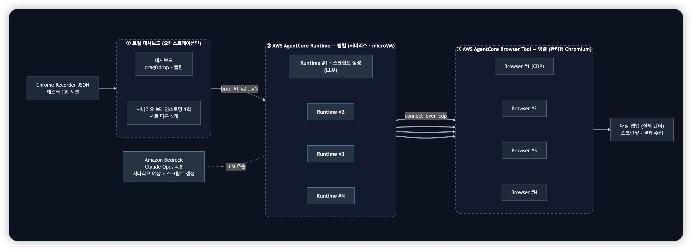
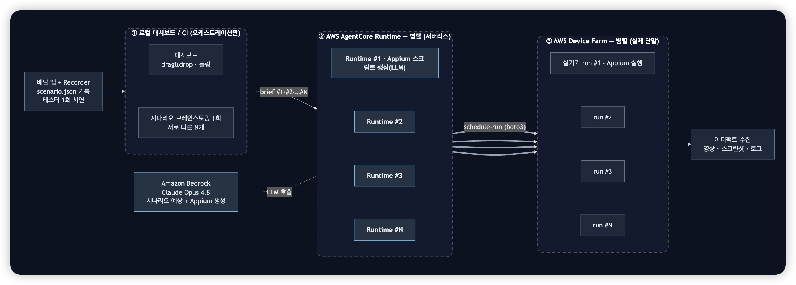

# 에이전트 기반 QA 자동화 (Agentic QA Automation on AWS)


테스터가 시나리오를 **한 번 녹화**하면, LLM(Amazon Bedrock Claude Opus 4.8)이 그 화면을 이해해
**서로 다른 여러 테스트 시나리오를 예상·생성**하고, 각 시나리오를 **독립된 AgentCore Runtime에서
동시에 실행**합니다. 웹(Playwright)과 모바일(Appium) 두 경로를 같은 패턴으로 다룹니다.

핵심은 **실행과 오케스트레이션을 모두 서버리스로 분산**한다는 것입니다. N개의 시나리오를 N개의
Runtime이 각자 실행하므로, 단일 서버(예: 큰 EC2 한 대)에 부하를 몰아넣을 때 생기는 병목·먹통 없이
스케일됩니다. 로컬(또는 CI)은 "시나리오 브레인스토밍 1회 + 실행 트리거"만 담당합니다.

## 아키텍처

두 경로 모두 **좌 → 우** 흐름이 동일합니다: 녹화 입력 → 로컬 오케스트레이션(브레인스토밍 1회)
→ **N개 AgentCore Runtime 병렬**(각자 Bedrock으로 테스트 스크립트 생성) → **N개 실행 플레인 병렬**
→ 결과 수집.

**웹 — Playwright + Amazon Bedrock AgentCore Browser Tool**(관리형 Chromium, CDP 연결)



**모바일 — Appium + AWS Device Farm**(실제 단말)



> 편집 가능한 원본: [web](diagrams/web_architecture.drawio) · [mobile](diagrams/mobile_architecture.drawio)
> (draw.io), HTML/Mermaid 버전도 `diagrams/`에 있습니다.

## 동작 방식 (파이프라인 순서)

### 1. 녹화 입력 (scenario 기록)

파이프라인의 입력은 **도구중립 JSON**입니다. 이 데모는 편의를 위해 미리 만든 샘플
(`samples/`)을 제공하지만, 실제로는 표준 녹화 도구의 출력을 그대로 씁니다.

- **웹**: Chrome DevTools Recorder로 브라우저에서 녹화 → Recorder JSON export, 또는
  Playwright의 CDP 로그 / `playwright codegen` 출력.
- **모바일**: Appium Inspector로 실기기 화면을 미러링하며 위젯을 클릭해 `resource-id`를 확인한 뒤
  시퀀스를 구성, 또는 앱에 내장한 Recorder로 tap/input/assert를 기록.

핵심은 **셀렉터(resource-id / DOM 셀렉터)가 안정적으로 들어있는 녹화**면 된다는 점입니다.
좌표 기반은 지양합니다.

### 2. 시나리오 브레인스토밍 (로컬, 1회)

Opus 4.8에 녹화 + 스크린샷을 주고, 그 앱에서 **테스트할 만한 서로 다른 시나리오 N개**를 예상하게
합니다(해피패스 · 엣지케이스 · 상태변경 · 필터 등). 결과는 각 시나리오의 한국어 제목/설명 +
코드 생성용 지시로 나옵니다. (`web/variations.py`의 `brainstorm_scenarios`)

### 3. 스크립트 생성 + 실행 (AgentCore Runtime, 병렬)

각 시나리오를 **AgentCore Runtime에 병렬로 invoke**합니다. 각 Runtime은 자기 microVM 안에서
Bedrock을 호출해 테스트 스크립트를 생성하고(웹=Playwright, 모바일=Appium), 그 자리에서 실행합니다.

- 웹: Runtime이 `browser_session` + `connect_over_cdp`로 **Browser Tool**에 붙어 실행하고
  스텝별 스크린샷을 반환합니다. (`agent/runtime_app.py`의 `scenario_run`)
- 모바일: Runtime이 Appium 스크립트를 만들어 **Device Farm**에 `schedule-run`으로 실기기 실행하고
  영상/스크린샷/로그를 수집합니다. (`infra/`)

로컬은 invoke만 하므로, N을 키워도 로컬 부하가 없습니다.

### 4. 결과 수집 · 대시보드

로컬 FastAPI 대시보드가 각 Runtime의 상태를 폴링하고, 완료된 스텝별 스크린샷·영상을 타일로
보여줍니다. (`dashboard/`)

## 직접 실습 해보기

### 사전 준비

- **AWS 계정 + 자격증명**(`aws configure`, 리전 **`us-west-2`**). AgentCore 지원 리전이고,
  AWS Device Farm은 사실상 us-west-2 전용입니다.
- 콘솔 → Bedrock → **Model access**에서 **Claude Opus 4.8** 활성화.
- Node.js 22+, Python 3.11+. (Docker 불필요 — direct-code-deploy)

### 인프라 배포 (CDK)

배포 상세는 [deploy/README.md](deploy/README.md)를 참고합니다. 요약:

```bash
cd deploy
python3 -m venv .venv && ./.venv/bin/pip install -r requirements.txt
AWS_REGION=us-west-2 CDK_DEFAULT_REGION=us-west-2 \
  npx aws-cdk@2 bootstrap --app "./.venv/bin/python app.py"
AWS_REGION=us-west-2 CDK_DEFAULT_REGION=us-west-2 \
  npx aws-cdk@2 deploy    --app "./.venv/bin/python app.py"
```

배포되는 리소스: `AWS::BedrockAgentCore::Runtime`(변환+실행 에이전트), 실행 역할(IAM),
`AWS::DeviceFarm::Project` + `DevicePool`. 출력의 `AgentRuntimeArn`을 다음 단계에서 씁니다.

### 대시보드 실행 (로컬)

```bash
# 리포 루트에서
python3 -m venv .venv
./.venv/bin/pip install -r agent/requirements.txt fastapi "uvicorn[standard]" requests

AGENT_BACKEND=agentcore \
AGENTCORE_ARN=<배포 출력의 AgentRuntimeArn> \
AGENTCORE_REGION=us-west-2 \
  ./.venv/bin/python -m uvicorn dashboard.server:app --port 8000
```

브라우저에서 http://localhost:8000 → **Web 탭**(기본)에서 `samples/`의 JSON을 드롭(또는
"샘플 불러오기") → "변환" → 변형 개수를 지정하고 "변형 생성 + 병렬 실행".

## 실행 결과

- 웹: 각 변형이 관리형 Chromium에서 독립 실행되어 스텝별 스크린샷이 타일로 표시됩니다.
- 모바일: Device Farm 실기기에서 실행된 후 녹화 영상과 스크린샷을 수집합니다.

### 데모 영상

**웹 — Playwright + AgentCore Browser Tool**

https://github.com/hanaarmi/agentcore-qa-automation/releases/download/video/playwright-agentcorebrowser-demo.mp4

**모바일 — Appium + AWS Device Farm**

https://github.com/hanaarmi/agentcore-qa-automation/releases/download/video/appium-devicefarm-demo.mp4

## 결론

- **부하 분산**: 실행(Browser Tool / Device Farm)과 오케스트레이션(AgentCore Runtime)을 모두
  서버리스로 분산해, 단일 서버에 몰아넣을 때의 병목 없이 N개 시나리오를 동시에 처리합니다.
- **한 번 녹화, 여러 시나리오**: LLM이 화면을 이해해 서로 다른 테스트를 예상·생성하므로,
  수동으로 시나리오를 일일이 작성할 필요가 줄어듭니다.
- **콘솔 클릭 최소화**: 배포는 CDK, 실행은 API로 자동화됩니다.

## 리소스 정리하기

```bash
cd deploy
AWS_REGION=us-west-2 CDK_DEFAULT_REGION=us-west-2 \
  npx aws-cdk@2 destroy --app "./.venv/bin/python app.py"
```

> 비용 주의: AgentCore Runtime / Browser Tool은 사용량 기반, Device Farm은 실행 분 기반
> 과금입니다(최초 1,000분 무료). 병렬 N개 실행은 그만큼 곱해지니 데모 후 정리를 권장합니다.

## 라이선스

MIT — [LICENSE](LICENSE)
